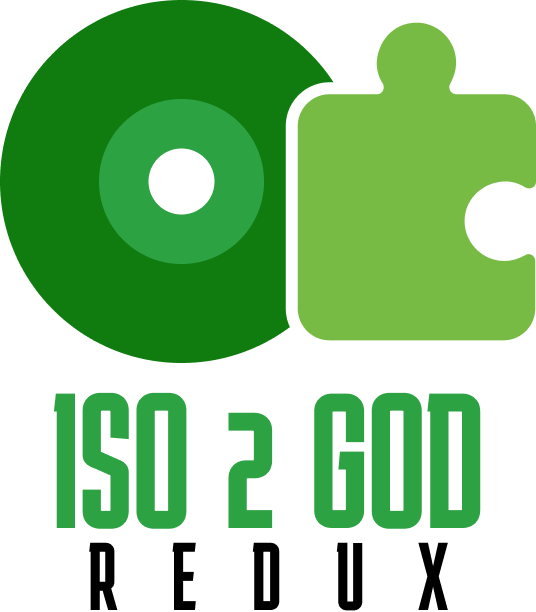
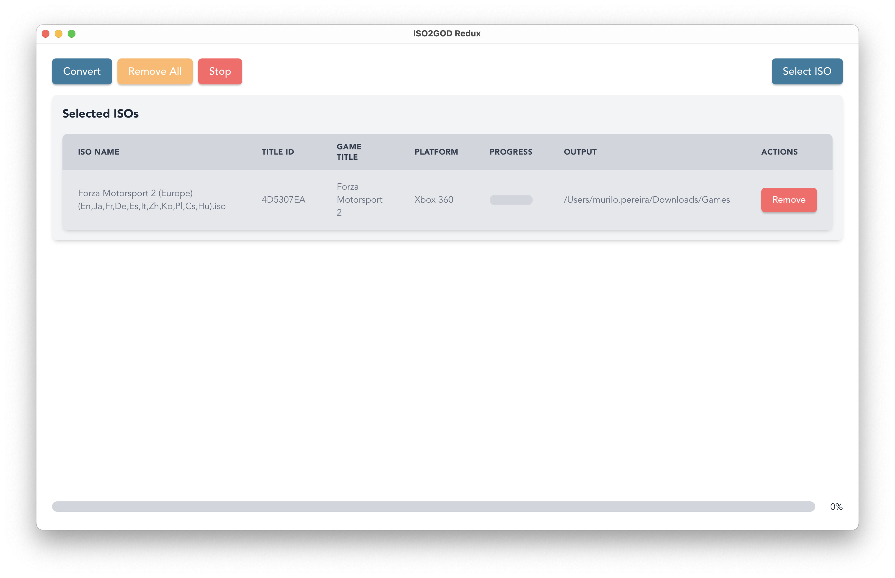

<!-- Logo at the very top -->
<p align="center">
  
</p>

# ISO2GOD Redux

**ISO2GOD Redux** is a cross‑platform desktop GUI, built with Tauri and Rust, wrapping the command‑line tool [*iso2god‑rs*](https://github.com/iliazeus/iso2god-rs) by iliazeus. 
It provides a user‑friendly interface for converting Xbox 360 and original Xbox ISO files into Xbox 360-compatible Games‑On‑Demand (GOD) format on Linux, Windows, and macOS.

---

## Features

- **Cross‑platform GUI**: Native desktop application using [Tauri](https://tauri.app) and Rust.
- **Comprehensive ISO conversion**: Convert Xbox 360 and original Xbox ISOs into GOD format.
- **Platform support**: Runs on **Linux**, **Windows**, and **macOS** seamlessly.
- **GUI controls for powerful features** inherited from iso2god-rs:
    - **Set custom game title**.
    - **Trim unused space** to reduce output size.
- **Convenient UX**: Drag‑and‑drop ISO support, progress bars and output directory selection.

---

## Screenshot



---

## Usage

1. Launch **ISO2GOD Redux**
2. Hit the **Select ISO** button or drag‑and‑drop an ISO file onto the window. 
3. In the GUI:
    - **Select** the output path (GOD Path).
    - Optionally toggle:
        - **Trim** 
    - Click **Save**.
4. Click the **Convert** button to start the conversion.
5. Watch progress, logs, and conversion success/failure.
6. Output files will be saved in the specified directories.

---

## Developing

### Prerequisites

- Supported OS: **Linux**, **Windows**, or **macOS**.
- Rust toolchain including `cargo` and `rustup`.
- Tauri prerequisites:
    - **For Windows**: Visual Studio Build Tools.
    - **For macOS**: Xcode Command Line Tools.
    - **For Linux**: libwebkit2gtk and other system dependencies (see Tauri docs).

### Installation

1. **Clone** this repository:
    ```bash
    git clone https://github.com/murilopereirame/iso2god-redux.git
    cd iso2god-redux
    ```

2. **Install** the required dependencies:
    ```
    yarn install
    ```

3. **Run in development mode**:
    ```bash
    yarn tauri dev
    ```

---

## Under the Hood

This project leverages **Tauri** to build a lightweight, native desktop interface with a Rust backend. 
Under the hood, it orchestrates `iso2god‑rs` (from iliazeus) using it as a Rust package.

- **iso2god‑rs**  
  A CLI tool to convert Xbox ISOs into Games‑On‑Demand format, available for Linux, Windows, and macOS :contentReference[oaicite:0]{index=0}.

- **Key iso2god‑rs options**:
    - `--dry-run` – simulate without conversion.
    - `--game-title <TITLE>` – set custom title.
    - `--trim` – remove unused ISO space.
    - `-j, --num-threads <N>` – specify worker threads.
    - `-h, --help`, `-V, --version` – help/version info.

---

## Contributing

Contributions are welcome! You can help with:

- UI improvements (modern look, accessibility).
- Localization.
- Adding a **Watch‑folder mode**, like in some python GUI projects (e.g., *[iso2god‑rs‑GUI](https://github.com/ItsDeidara/iso2god-rs-GUI)* )
- Packaging and installer generation for all platforms.

---

## License

**iso2god‑redux** is licensed under the **MIT License**. It uses **iso2god‑rs**, which is also MIT-licensed.

---

## Acknowledgments

- **r4dius** for the original **[iso2god](https://github.com/r4dius/Iso2God)** project.
- **iliazeus** for creating the rust converter, **[iso2god‑rs](https://github.com/iliazeus/iso2god-rs)**
- **Tauri team** for enabling cross-platform native GUIs with Rust with [Tauri](https://v2.tauri.app).

---

Thanks for using **ISO2GOD Redux**! If you need help or have ideas to improve it, feel free to raise issues or submit pull requests.

---